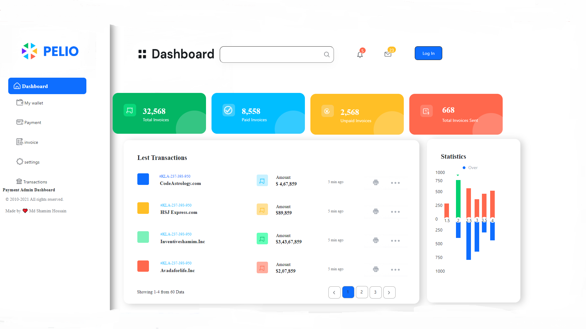
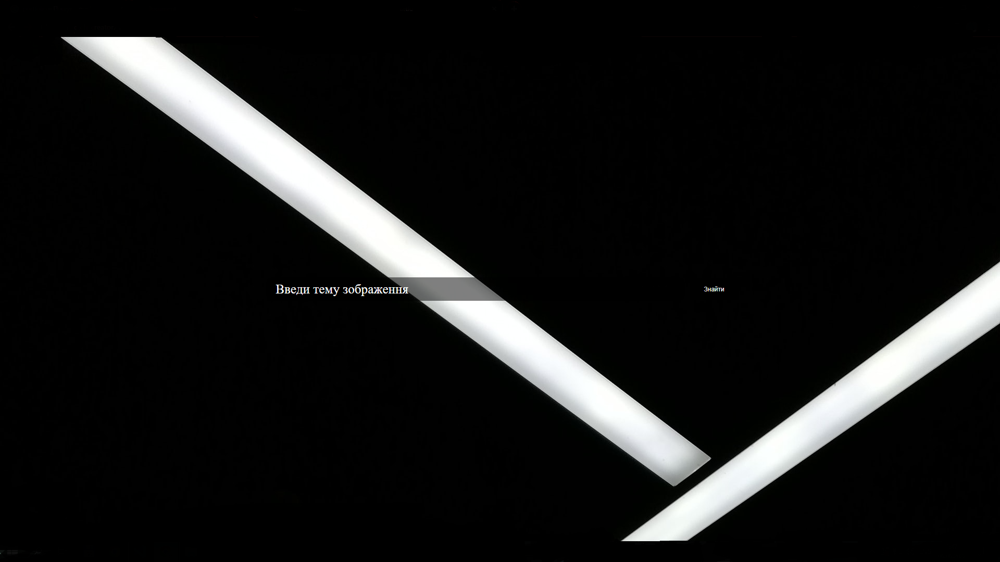
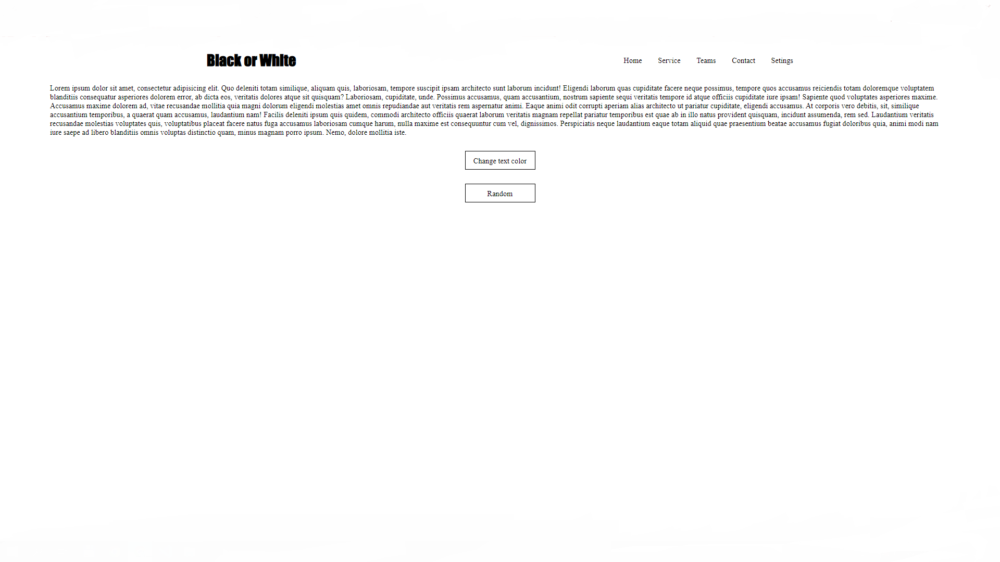
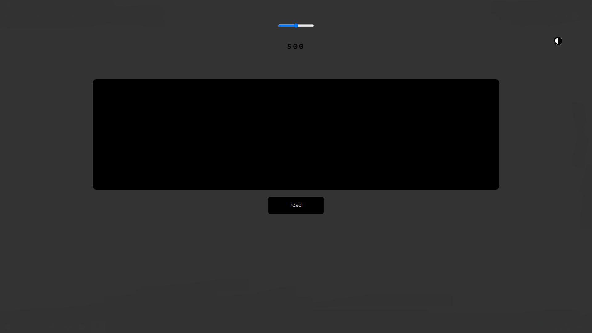

<!DOCTYPE html>
<html lang="en">
<head>
    <meta charset="UTF-8">
    <meta http-equiv="X-UA-Compatible" content="IE=edge">
    <meta name="viewport" content="width=device-width, initial-scale=1.0">
    <title>Portfolio</title>
    <link rel="icon" type="image/png" href="img/man.png"/>
    <link rel="stylesheet" href="style.css">
  
</head>
<body>
    

        

            <h2>My Portfolio</h2>
<h3 class="home" id="home">Home</h3>
<h3 class="About" id="About">About</h3>
<h3 class="Projekt" id="Projekt">Projekts</h3>
        

        

            <h1 class="Hello">Hi,There
                 
                I'm Oleh Stetsyk
            </h1>
             
            <h2>I am Web Developer</h2>
             
             
            
<h3>My skils</h3>

            
             
            
            
            

            

 
 HTML
 

 
 CSS
 

 
 JS
 

 
 NodeJS
 

        

        

            

                 
            
Its Pelio this is site where you can see your statistik and mani grafiks

             
             
            <a href="https://github.com/Oleh-Creator/Pelio">
Code
</a>
            

            

                
           
In this site you can found oll img what you need

            
            
           <a href="https://github.com/Oleh-Creator/Img">
Code
</a>
           

           

            
       
In this site you can choose any color of page and text

        
        
       <a href="https://github.com/Oleh-Creator/Colors">
Code
</a>
       

       

        
   
In this site you can red your text

    
    
   <a href="https://github.com/Oleh-Creator/Time">
Code
</a>
   

           
           
        

        

            
            <h2 class="box4Name"> 
* Hello my name is Oleh Stetsyk.

                 
              
 * I am 16 years old
 
               
               
* I am from Ukraine

                
               
* And I am student Creator IT Academy

                
               
* My skils: HTML; CSS; JS

            </h2>
         
        

    

       
    
</body>
</html>
